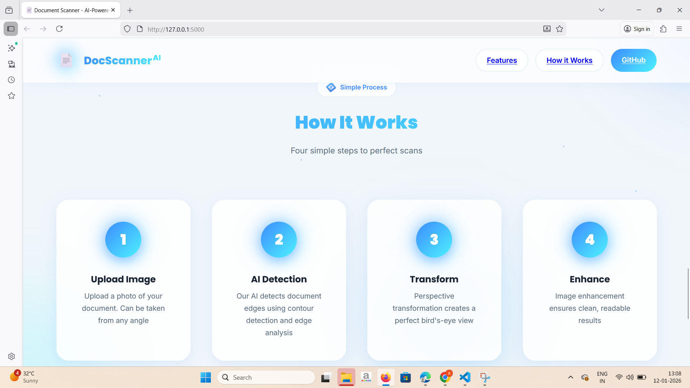

# 📄 Document Scanner Using Homography

> AI-powered document scanner that automatically detects, crops, and enhances documents using computer vision and perspective transformation.


## ✨ Features

- 🤖 **Automatic Document Detection** - Uses advanced contour detection to find document boundaries
- 📐 **Perspective Correction** - Applies homography transformation for perfect top-down view
- ✨ **Smart Enhancement** - Multiple enhancement modes (Adaptive, CLAHE, Sharpen, Original)
- ⚡ **Lightning Fast** - Processes documents in under 3 seconds
- 📱 **Mobile Friendly** - Fully responsive design that works on all devices
- 🎨 **Modern UI** - Clean, intuitive interface with drag & drop support
- 🔒 **Privacy First** - All processing happens locally on your server
- 💾 **Auto Cleanup** - Automatically removes old files to save disk space

## 🎯 Demo

### How It Works

1. **Upload** - Upload or drag & drop a document image
2. **Select Enhancement** - Choose your preferred enhancement mode
3. **Scan** - AI automatically detects and scans the document
4. **Download** - Get your clean, scanned document

### Enhancement Modes

| Mode | Description | Best For |
|------|-------------|----------|
| **Adaptive** | Clean black & white scan | Text documents, receipts |
| **CLAHE** | Enhanced contrast | Low-light photos |
| **Sharpen** | Sharper details | Blurry images |
| **Original** | No enhancement | Color documents |

## 🚀 Quick Start

### Prerequisites

- Python 3.7 or higher
- pip (Python package manager)
- 16MB+ free disk space

### Installation

1. **Clone or download this repository**

```bash
cd document_scanner_web
```

2. **Create a virtual environment** (recommended)

```bash
# Windows
python -m venv venv
venv\Scripts\activate

# macOS/Linux
python3 -m venv venv
source venv/bin/activate
```

3. **Install dependencies**

```bash
pip install -r requirements.txt
```

4. **Run the application**

```bash
python app.py
```

5. **Open your browser**

Navigate to: [http://localhost:5000](http://localhost:5000)

That's it! 🎉

## 📁 Project Structure

```
document_scanner_web/
│
├── app.py                      # Flask backend application
├── config.py                   # Configuration settings
├── requirements.txt            # Python dependencies
├── README.md                   # This file
│
├── scanner/                    # Document scanner module
│   ├── __init__.py
│   └── scanner.py             # Core CV logic (OpenCV pipeline)
│
├── static/                     # Static assets
│   ├── uploads/               # Uploaded images (auto-created)
│   ├── outputs/               # Scanned outputs (auto-created)
│   ├── css/
│   │   └── style.css          # Styling
│   └── js/
│       └── main.js            # Frontend logic
│
└── templates/                  # HTML templates
    └── index.html             # Main page
```

## 🏗️ Architecture

### Backend (Flask)

The Flask backend provides two main routes:

- **GET /** - Serves the main web page
- **POST /scan** - Processes document images

#### Document Scanning Pipeline

```python
1. Load image
2. Preprocess (resize, grayscale, blur, edge detection)
3. Detect document contour (find 4-point boundary)
4. Order corner points (top-left, top-right, bottom-right, bottom-left)
5. Apply perspective transformation (homography)
6. Enhance image (adaptive thresholding / CLAHE / sharpen)
7. Save and return result
```

### Frontend (HTML/CSS/JavaScript)

- **HTML** - Semantic, accessible markup
- **CSS** - Modern, responsive design with CSS custom properties
- **JavaScript** - Vanilla JS with async/await for API calls

#### Key Frontend Features

- Drag & drop file upload
- Real-time validation
- Loading states with spinner
- Error handling with helpful tips
- Side-by-side comparison view
- One-click download
- Keyboard shortcuts (Ctrl+U to upload, Escape to reset)

## 🔧 Configuration

Edit `config.py` to customize settings:

```python
# File upload settings
MAX_FILE_SIZE = 16 * 1024 * 1024  # 16MB
ALLOWED_EXTENSIONS = {'png', 'jpg', 'jpeg', 'gif', 'bmp', 'tiff', 'webp'}

# Processing settings
PROCESSING_WIDTH = 800  # Image width for processing
DEFAULT_ENHANCE_MODE = 'adaptive'

# Cleanup settings
FILE_MAX_AGE = 3600  # 1 hour (in seconds)
```

## 🎨 Customization

### Changing Colors

Edit CSS custom properties in `static/css/style.css`:

```css
:root {
    --color-primary: #3b82f6;      /* Primary brand color */
    --color-success: #10b981;      /* Success color */
    --color-error: #ef4444;        /* Error color */
    /* ... more variables */
}
```

### Adding New Enhancement Modes

1. Add the enhancement logic in `scanner/scanner.py`:

```python
elif mode == 'your_mode':
    # Your enhancement code here
    enhanced = your_enhancement_function(gray)
```

2. Add the option in `templates/index.html`:

```html
<label class="option-card">
    <input type="radio" name="enhance" value="your_mode">
    <div class="option-content">
        <span class="option-icon">🎨</span>
        <span class="option-name">Your Mode</span>
        <span class="option-desc">Your description</span>
    </div>
</label>
```
## 🧪 Testing

Run tests (if pytest is installed):

```bash
pytest
```

Manual testing checklist:

- ✅ Upload image via browse button
- ✅ Upload image via drag & drop
- ✅ Select each enhancement mode
- ✅ Scan document successfully
- ✅ Download scanned document
- ✅ Handle error when no document detected
- ✅ Handle large file upload
- ✅ Test on mobile device
- ✅ Test keyboard shortcuts


## 📝 Technical Details

### Computer Vision Algorithms Used

1. **Canny Edge Detection** - Detects edges in the image
2. **Contour Detection** - Finds document boundary
3. **Douglas-Peucker Algorithm** - Approximates contour to 4 points
4. **Homography (Perspective Transform)** - Warps document to top-down view
5. **Adaptive Thresholding** - Creates clean B&W scan
6. **CLAHE** - Contrast Limited Adaptive Histogram Equalization
7. **Morphological Operations** - Cleans up edge detection

### Dependencies

- **Flask 3.0.0** - Web framework
- **OpenCV 4.9.0** - Computer vision library
- **NumPy 1.24.3** - Numerical computing
- **Gunicorn 21.2.0** - Production WSGI server (optional)

## 🤝 Contributing

Contributions are welcome! Here are some ideas:

- 🎨 Add more enhancement modes
- 📱 Add mobile app support
- 🔐 Add user authentication
- 💾 Add database support for history
- 📊 Add batch processing
- 🌐 Add multi-language support
- 🎯 Add OCR (text extraction)
- 📄 Add PDF export

## 🖼️ Screenshots

### 🏠 Home Page


---

### ⚙️ Working


---

### 📤 Upload Page


---

### 🏆 Feature 1


---

### 🚀 Feature 2


---

## 📄 Scan Page


---

## 📦 Output Results

### Output 1


### Output 2


### Output 3


### Output 4


### Output 5


### 


**Happy Scanning! 📄✨**

